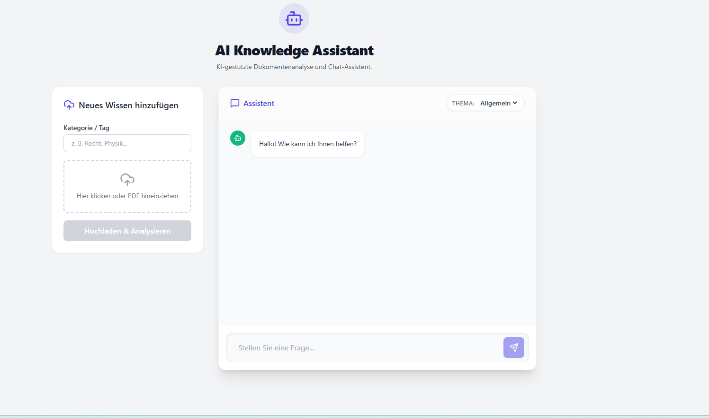

🤖 RAG-Basierter KI-Chat-Assistent (MERN Stack) Dieses Projekt ist eine RAG-Anwendung 

(Retrieval-Augmented Generation), die es Benutzern ermöglicht, eigene PDF-Dokumente hochzuladen und einen KI-gestützten Chat über diese Inhalte zu führen.

Benutzer können Dokumente in bestimmte Kategorien einteilen und beim Stellen von Fragen Antworten erhalten, die nur auf den Daten der ausgewählten Kategorie basieren.

🚀 Über das Projekt Diese Anwendung geht über Standard-Chatbots hinaus und ermöglicht es Ihnen, mit Ihren eigenen Daten zu sprechen. Die RAG-Architektur wird verwendet, um Halluzinationen von LLMs (Large Language Models) zu verhindern und präzise Informationen bereitzustellen.

Hauptmerkmale:

📄 PDF-Upload & Verarbeitung: Wandelt PDF-Dateien in Text um und unterteilt sie in Abschnitte (Chunking).

🗂️ Kategoriebasierte Filterung: Daten werden beim Hochladen getaggt (z. B. "Test-1", "Vorlesungsnotizen"). Suchanfragen werden nur innerhalb der ausgewählten Kategorie durchgeführt.

🧠 Vektorsuche (Vector Search): Semantische Suche wird mithilfe von MongoDB Atlas Vector Search durchgeführt.

⚡ Streaming-Antwort: Die KI-Antwort erscheint Teil für Teil auf dem Bildschirm (Echtzeit-Erlebnis wie bei einer Schreibmaschine).

🔒 Lokale Embeddings: Die Vektorisierung (Embedding) erfolgt serverseitig (Xenova/transformers), um externe Abhängigkeiten zu reduzieren.

🛠️ Technologien (Tech Stack) Dieses Projekt wurde mit modernen Webtechnologien entwickelt:

Frontend React (Vite): Schnelle und modulare Benutzeroberfläche.

Fetch API (Stream Reader): Zum Lesen der stückweise übertragenen Daten vom Backend.

CSS Modules / Inline Styles: Sauberes und angepasstes Design.

Backend Node.js & Express: API- und Serververwaltung.

Multer: Verarbeitung von Datei-Uploads.

PDF-Parse: Konvertierung von PDF-Inhalten in Text.

LangChain / Transformers.js: Umwandlung von Texten in Vektorformate (Embeddings).

Groq SDK (Llama-3): Hochgeschwindigkeits-LLM (KI-Engine).

Datenbank MongoDB Atlas: Datenspeicherung.

Atlas Vector Search: Vektorbasierte Dokumentensuche und Filterung.

⚙️ Installation Befolgen Sie diese Schritte, um das Projekt auf Ihrem lokalen Computer auszuführen:

Repository klonen Bash git clone https://github.com/IHR_BENUTZERNAME/REPO_NAME.git cd REPO_NAME
Backend-Einrichtung Wechseln Sie in das Server-Verzeichnis und installieren Sie die Abhängigkeiten:
Bash cd server npm install Erstellen Sie eine .env-Datei im server-Ordner und fügen Sie folgende Informationen hinzu:

Kod snippet'i PORT=5000 MONGODB_URI=mongodb+srv://:@cluster.mongodb.net/rag_db?retryWrites=true&w=majority GROQ_API_KEY=gsk_... (Ihr Groq API-Schlüssel) Starten Sie den Server:

Bash node server.js

🧠 Wie es funktioniert (Architektur) Aufnahme (Ingestion): Der Benutzer lädt ein PDF hoch und legt eine Kategorie fest (z. B. HR-Richtlinien).

Einbettung (Embedding): Das Backend unterteilt den PDF-Text in kleine Stücke und wandelt jedes Stück in numerische Vektoren um.

Speicherung: Vektoren und Textteile werden zusammen mit dem Kategorie-Tag in MongoDB gespeichert.

Abruf (Retrieval): Wenn der Benutzer eine Frage stellt, wird diese Frage ebenfalls in einen Vektor umgewandelt.

Suche: MongoDB Atlas findet die semantisch ähnlichsten Dokumententeile zum Fragevektor (nur innerhalb der ausgewählten Kategorie!).

Generierung: Die gefundenen Teile + die Benutzerfrage werden an die Groq API (Llama-3) gesendet. Die KI generiert daraufhin die Antwort basierend auf diesen Informationen.

🔮 Roadmap (Geplante Funktionen) [ ] Verbesserte Benutzeroberfläche (UI/UX).

[ ] Speichern des Chatverlaufs (Chat History).

[ ] Unterstützung für weitere Dateiformate (Word, Txt).

[ ] Mehrsprachigkeit.
